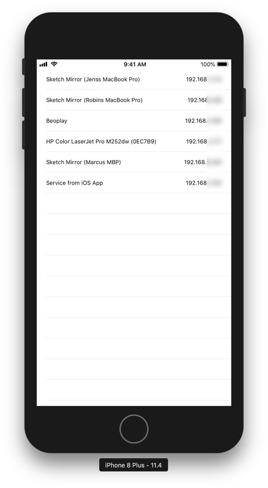

# NetworkService


[](https://github.com/thepeaklab/NetworkService/blob/master/LICENSE)
[](https://twitter.com/thepeaklab)

`NetworkService` is a small wrapper for Apples [NetService](https://developer.apple.com/documentation/foundation/netservice) classes in [Foundation](https://developer.apple.com/documentation/foundation).

## Install

### Carthage

To install `NetworkService` with Carthage, setup Carthage for your project as described in the [Quick Start](https://github.com/Carthage/Carthage#quick-start).

Then add this line to your Cartfile:

```
github "thepeaklab/NetworkService" ~> 0.1.0
```

### Swift Package Manager

To install `NetworkService` with [Swift Package Manager](https://swift.org/package-manager) add `NetworkService` to your `Package.swift`

```swift
// swift-tools-version:4.0
// The swift-tools-version declares the minimum version of Swift required to build this package.

import PackageDescription

let package = Package(
    name: "Dependencies",
    products: [
        .library(name: "Dependencies", targets: ["Dependencies"]),
    ],
    dependencies: [
        .package(url: "https://github.com/thepeaklab/NetworkService", from: "0.1.0")
    ],
    targets: [
        .target(name: "Dependencies", dependencies: ["NetworkService"])
    ]
)

```

### Example

Find an example here: [Example](Example)



## Usage

### Publish Service

```swift
let networkService = NetworkService()
networkService.startPublish(type: .http, name: "My HTTP Server", port: 80)

// to stop publishing
networkService.stopPublish()
```

#### Custom Service Types

When you don't want to use one of the predefined service types you can use your own type.
By using `.tcp(name: String)`or `.udp(name: String)` with a lowercase string without spaces you can define your own type.

```swift
let networkService = NetworkService()
networkService.startPublish(type: .tcp(name: "mycustomservice"), name: "My Custom Service", port: 1234)
```

The Example will result in the following DNS type: `_mycustomservice._tcp.`

### Browse Services

```swift
let networkService = NetworkService()
networkService.delegate = self
networkService.startBrowse(type: .http)

// NetworkServiceDelegate

public func networkService(_ networkService: NetworkService,
                           didFind service: NetService,
                           moreComing: Bool,
                           didStartResolve: Bool) {
    // found service
    print(service.name)
}
```

### Resolve an address from a service

```swift
let networkService = NetworkService()
networkService.delegate = self
networkService.startBrowse(type: .http)

// NetworkServiceDelegate

public func networkService(_ networkService: NetworkService,
                           didFind service: NetService,
                           moreComing: Bool,
                           didStartResolve: Bool) {
    networkService.startResolve(service)
}

public func networkService(_ networkService: NetworkService,
                           didResolve service: NetService,
                           address: String) {
    // resolved services address
    print("address: \(address)")
}
```

#### Auto Resolve

When `isAutoResolveEnabled` is set to `true` every found service will be resolved.

```swift
let networkService = NetworkService()
networkService.delegate = self
networkService.isAutoResolveEnabled = true
networkService.startBrowse(type: .http)

// NetworkServiceDelegate

public func networkService(_ networkService: NetworkService,
                           didResolve service: NetService,
                           address: String) {
    // resolved services address
    print("address: \(address)")
}
```

### Closure Syntax instead of delegates

```swift
let networkService = NetworkService()
let delegate = NetworkServiceClosureDelegate()
delegate.didFindService = { service, moreComing, didStartResolve in
    print("found service \(service.name)")
}
networkService.delegate = delegate
networkService.startBrowse(type: .http)
```

## Need Help?

Please [submit an issue](https://github.com/thepeaklab/NetworkService/issues) on GitHub.

## License

This project is licensed under the terms of the MIT license. See the [LICENSE](LICENSE) file.